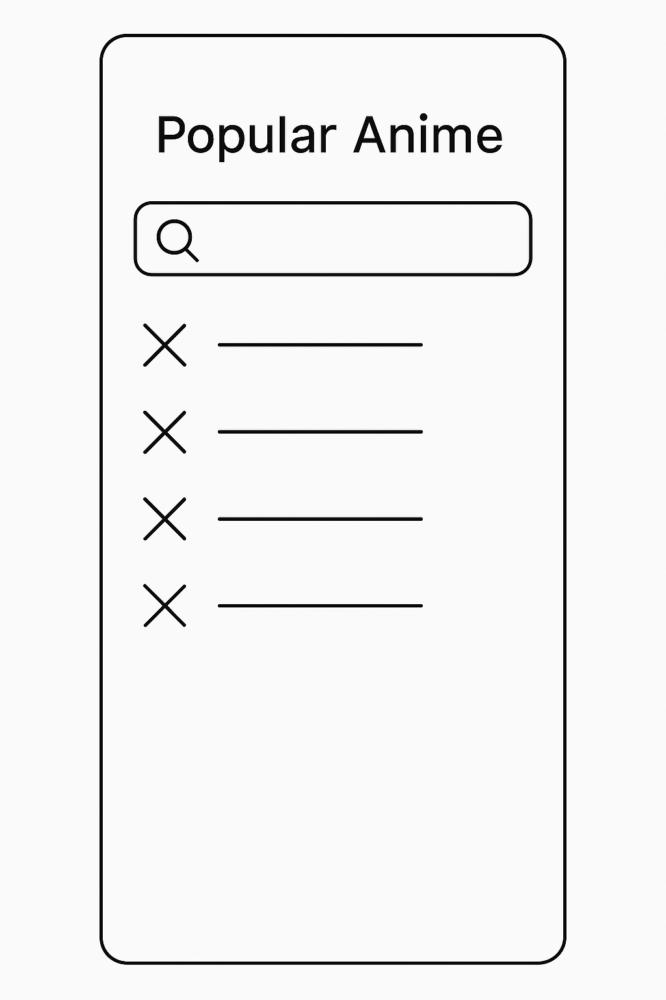
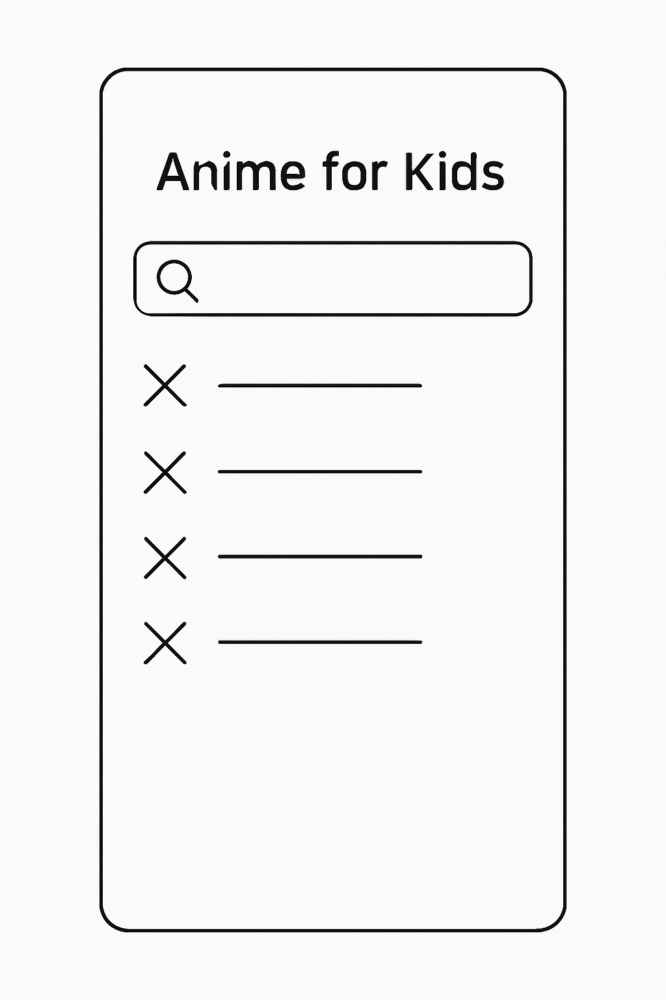
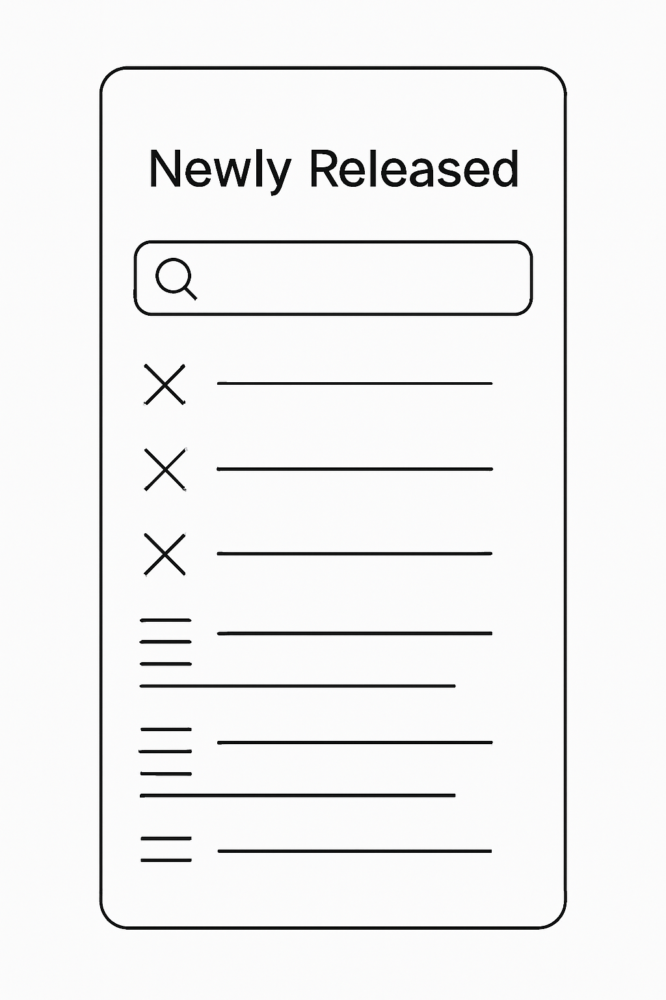
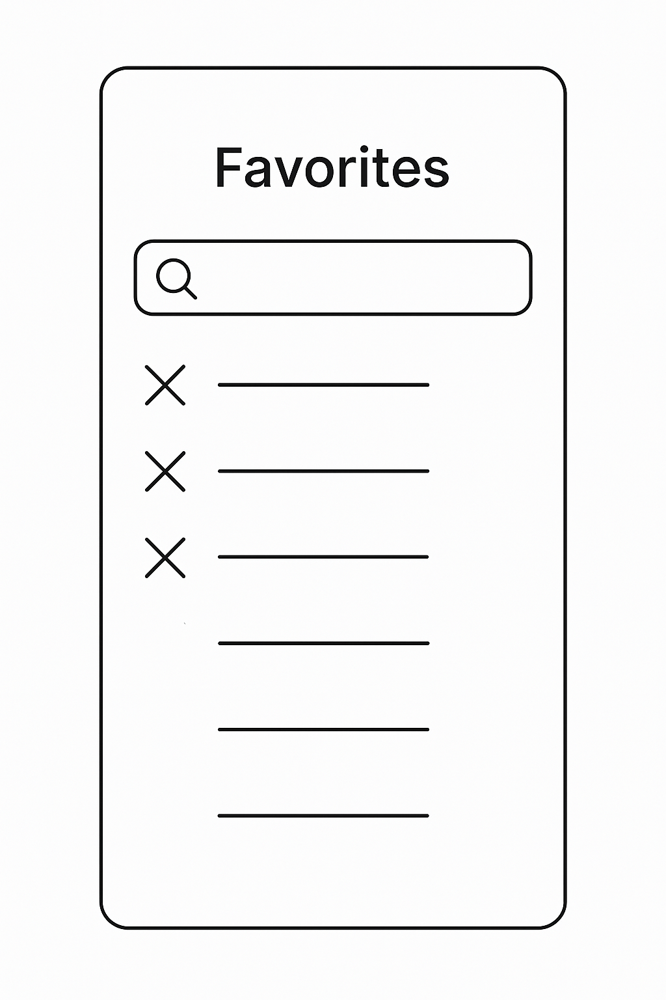

## KawaKloud (version 2.0 schematics and framework)
// Primary Restful Api for Anime/Manga database https://api.myanimelist.net/v2 

// The purpose of the application is to act as a search database similar to Bing specific to Anime series/movies. Users will be able to type in keywords and quotes to find a specific related anime (or character within show) and find new shows to enjoy. The ultimate goal will be to transform this platform to a social network and there are developments happening within the API platform that will allow for this function in the future. 
## 
// Tools needed: Coding space, .NetMaui installed for Android/Ios platform, (site will more than likely end up operating off of more than one Api to enhance database search results), separate mobile device to test simulation.

## Structure (will be updated)
//Information architecture will consist of a main page with a search element at the top with several shortcut tiles underneath to common topic searches, Upon click the search will render multiple pages of option (aiming for 5) based upon search and each search result screen will have a home tab to return to original search screen. Eventually there will be a social hub that will display top contacts and status updates. Major production studios will have verified accounts.

//wireframing for content pages: 
 
 
 
 

 ## Simulation bug fixes in progress
